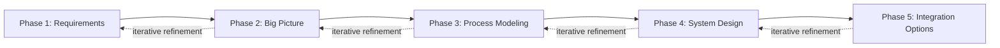
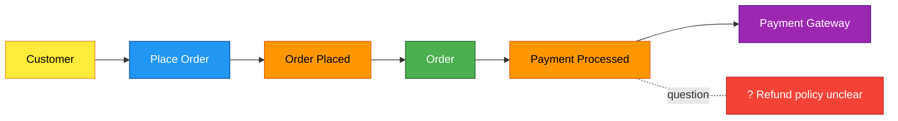
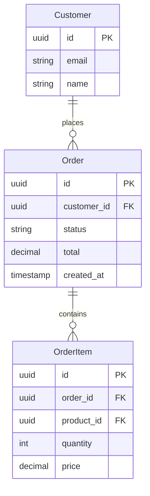
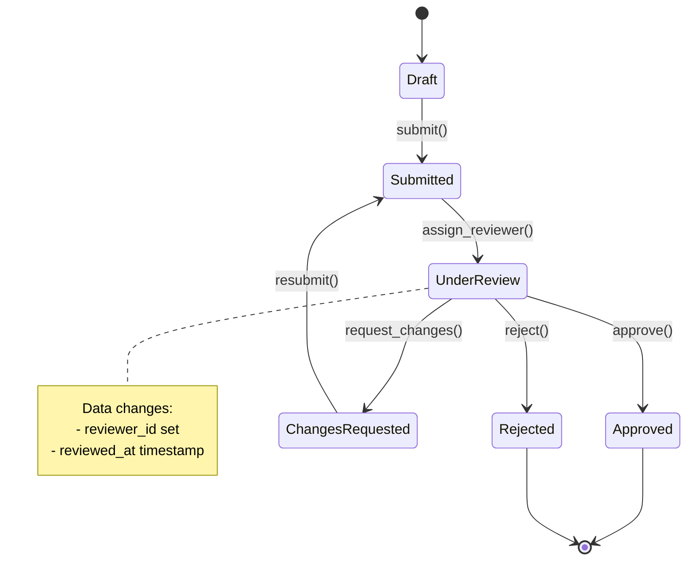
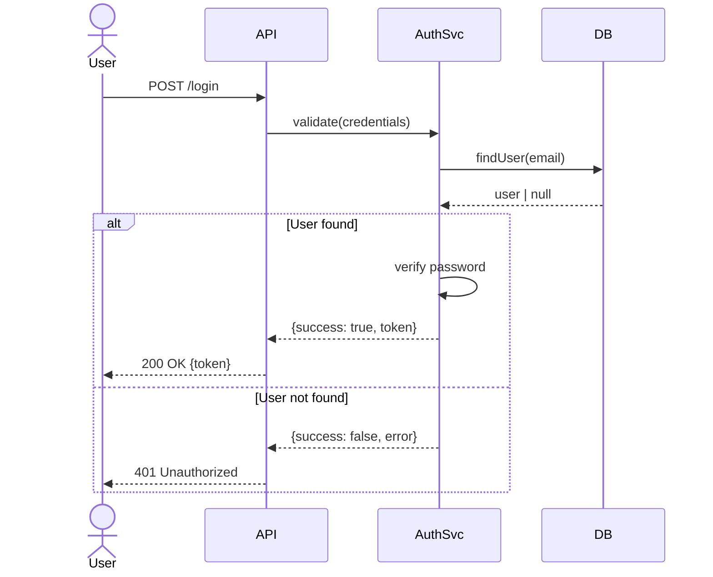

# System Design Skill - Design Document

**Date:** 2025-11-06
**Status:** Design Phase Complete
**Next Steps:** TDD Implementation (RED-GREEN-REFACTOR)

## Overview

A structured skill for transforming requirements into comprehensive system designs through iterative refinement, using Mermaid diagrams and EventStorming methodology. The skill produces a navigable design catalog that minimizes token cost while maximizing design clarity.

**Core Principle:** Progressive elaboration through 5 phases, building a catalog of interconnected design artifacts, with support for iterative refinement at any stage.

## Target Audience

- Solo developers designing their own systems
- Teams collaborating on system architecture
- Claude agents planning implementation before coding
- Anyone needing structured system design process

## Design Goals

1. **Consistency & Review-Friendly**: Unidirectional workflow where details are evaluated similarly (waterfall-style progression with iteration support)
2. **Token Efficiency**: Diagrams-first approach using Mermaid to minimize verbose descriptions
3. **Navigability**: Catalog structure enables easy discovery and cross-referencing
4. **Integration**: Can flow to implementation planning or pumped-design mapping
5. **Flexibility**: Support iterative refinement - can jump back to earlier phases as insights emerge

## Architecture: Hybrid Phase + Catalog Approach

### Phase Structure



**Progression Strategy:**
- Linear flow for initial design
- Bidirectional refinement when insights emerge
- Each phase produces concrete artifacts
- Validation gates before advancing (but flexible)

### Catalog Structure

```
docs/design-catalog/
  README.md              # Navigation hub with embedded diagrams
  requirements.md        # Business goals, constraints, actors
  big-picture.mmd        # EventStorming big picture (timeline)
  processes/
    process-{name}.mmd   # Process-level EventStorming
  data/
    erd.mmd              # Entity-Relationship diagram
    state-{entity}.mmd   # State chart diagrams
  flows/
    sequence-{flow}.mmd  # Sequence diagrams
```

## Phase Details

### Phase 1: Requirements Understanding

**Purpose:** Gather context before design

**Activities:**
- Ask questions ONE at a time (following brainstorming pattern)
- Use AskUserQuestion for architectural choices with trade-offs
- Identify: business goals, constraints, key actors, success criteria

**Output:** `requirements.md`

**Example Questions:**
- "What problem does this system solve?"
- "Who are the primary users/actors?"
- "What are the critical constraints?" (performance, scale, budget, timeline)
- "How do you define success for this system?"

### Phase 2: EventStorming Big Picture

**Purpose:** Understand business process at high level

**Methodology:** EventStorming adapted to Mermaid timeline

**Activities:**
- Identify key business events (what happens in the system)
- Add commands (what triggers events)
- Add actors (who initiates commands)
- Add external systems (third-party integrations)
- Mark hotspots (unclear areas, questions, risks)

**Mermaid Convention:**
- Flowchart LR (left-to-right timeline)
- Color-coded elements:
  - Events: Orange (#ff9800)
  - Commands: Blue (#2196f3)
  - Actors: Yellow (#ffeb3b)
  - Systems: Purple (#9c27b0)
  - Aggregates: Green (#4caf50)
  - Hotspots: Red (#f44336)

**Output:** `big-picture.mmd`

**Validation:** Present diagram, ask: "Does this capture the high-level flow?"

### Phase 3: Process EventStorming

**Purpose:** Detail specific processes from big picture

**Activities:**
- Select critical processes to zoom into
- For each process:
  - Map detailed event sequences
  - Identify aggregates (data entities)
  - Show state transitions
  - Mark policies (business rules)

**Output:** `processes/process-{name}.mmd` (one per process)

**Validation:** Review each process diagram before moving to next

### Phase 4: System Design Artifacts

**Purpose:** Model data, state, and interactions

**4.1 Entity-Relationship Diagram (ERD)**
- Extract entities from process diagrams
- Define relationships, attributes, constraints
- Use Mermaid ER diagram syntax
- **Output:** `data/erd.mmd`

**4.2 State Charts**
- Identify entities with complex lifecycles
- Map states, transitions, triggers
- Annotate data changes per transition
- Use Mermaid stateDiagram-v2
- **Output:** `data/state-{entity}.mmd` (one per entity)

**4.3 Sequence Diagrams**
- Select critical/complex flows
- Map actor/system interactions
- Show success and error paths
- Use Mermaid sequenceDiagram
- **Output:** `flows/sequence-{flow}.mmd` (one per flow)

**Validation:** Present all artifacts, ask: "Does this system design feel complete?"

### Phase 5: Integration & Next Steps

**Purpose:** Assemble catalog and plan next actions

**Activities:**
- Generate catalog README with navigation and embedded diagrams
- Present complete design catalog
- Ask: "Ready to proceed with implementation planning?"

**Options:**
- **Standalone design:** Stop here, design artifacts complete
- **Implementation planning:** Use writing-plans skill to create task breakdown
- **Pumped-design mapping:** (If backend + pumped-fn) Map catalog to pumped-fn structure

## Mermaid Templates

### EventStorming Big Picture Template



### ERD Template



### State Chart Template



### Sequence Diagram Template



## Token Efficiency Strategies

1. **Diagrams over prose**: Prefer Mermaid diagrams over lengthy text descriptions
2. **Incremental validation**: Show artifacts section-by-section, validate before continuing
3. **Templates with examples**: Reference templates, fill with project specifics
4. **Cross-reference**: Link between artifacts instead of repeating information
5. **Catalog README as hub**: Single navigation point prevents token-heavy redundant explanations
6. **Embedded diagrams**: README embeds diagram content for one-stop viewing

## Iterative Refinement Support

Users can jump back to earlier phases when new insights emerge:

- "Let's refine requirements" → Return to Phase 1, update artifacts downstream
- "Big picture is missing X" → Return to Phase 2, revise timeline
- "Process needs more detail" → Return to Phase 3, expand specific process
- "Data model has issues" → Return to Phase 4, adjust ERD

**Flexibility principle:** Design is discovery - support non-linear progression

## Integration with Existing Skills

### Brainstorming Skill
- Phase 1 (Requirements) uses brainstorming question patterns
- AskUserQuestion for architectural choices
- One question at a time, incremental validation

### Writing-Plans Skill
- Optional handoff after Phase 5
- Design catalog feeds into implementation planning
- Artifacts provide context for task breakdown

### Pumped-Design Skill
- Optional mapping for backend systems
- Translate design catalog to pumped-fn catalog structure
- ERD → resources, Flows → flows, Sequences → integration patterns

### Writing-Skills (TDD for Documentation)
- Skill creation follows RED-GREEN-REFACTOR
- Test with example projects
- Baseline behavior → Write skill → Verify compliance

## Skill File Structure

```
skills/system-design/
  SKILL.md              # Main skill reference
  templates/
    requirements.md     # Requirements template
    catalog-readme.md   # Catalog README template
  examples/            # Will be created during TDD phase
    ecommerce/         # Example 1: E-commerce system
    saas-auth/         # Example 2: SaaS authentication
    iot-platform/      # Example 3: IoT data platform
```

## Success Criteria

**The skill is successful when:**
1. Claude can guide user from vague idea to complete design catalog
2. Artifacts are navigable and cross-referenced
3. Token usage is efficient (diagrams > text)
4. User can iterate on design without starting over
5. Design catalog can feed into implementation planning
6. Works for diverse domains (e-commerce, SaaS, IoT, etc.)

## Next Steps (Phase 5: Skill Creation)

Following **writing-skills** TDD methodology:

### RED Phase
1. Create 3+ example project scenarios with progression
2. Run baseline tests with subagents WITHOUT skill
3. Document rationalizations and failures

### GREEN Phase
1. Write SKILL.md addressing baseline failures
2. Write templates for catalog artifacts
3. Test with same scenarios - verify compliance

### REFACTOR Phase
1. Identify new rationalizations from testing
2. Add explicit counters to skill
3. Close loopholes, re-test until bulletproof

### Example Projects (To Be Created)
1. **E-commerce platform**: Order management, payment processing, inventory
2. **SaaS authentication system**: Multi-tenant auth, session management, RBAC
3. **IoT data platform**: Device telemetry, real-time processing, alerting

Each example should show progression through all 5 phases with realistic complexity.

## Open Questions

- Should catalog support versioning (v1, v2 of design)?
- Should hotspots from EventStorming have dedicated tracking?
- Integration with diagramming tools beyond Mermaid (export options)?

---

**Design approved and ready for TDD implementation.**
