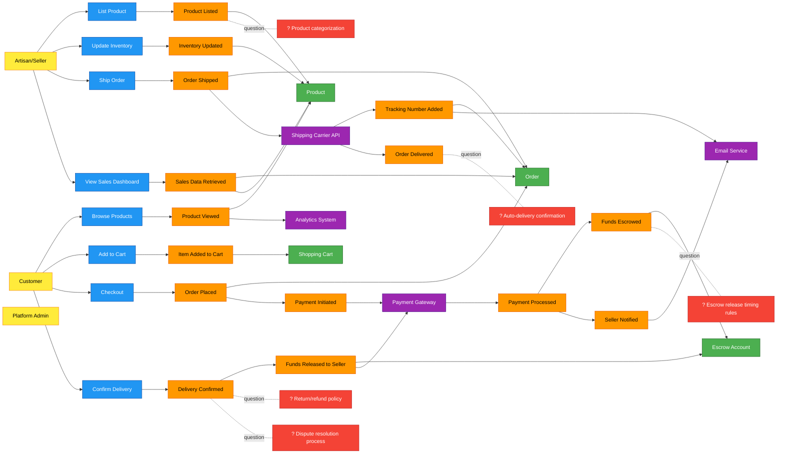

# Design Catalog: Artisan E-commerce Platform

## Overview

An e-commerce platform connecting artisans with customers for selling handmade products. The platform provides a trust layer through escrow-based payments, ensuring safe transactions between makers and buyers while giving artisans full control over their inventory and fulfillment.

## Requirements

See [requirements.md](./requirements.md) for detailed requirements, actors, constraints, and success criteria.

**Key highlights:**
- Target scale: 1K-10K users, 100-1000 products
- Platform escrow payment model
- Seller-managed fulfillment
- Phased rollout: 6-12 months

## Big Picture EventStorming

The following diagram shows the high-level business process with key events, commands, and actors:

[View source](./big-picture.mmd)

## Process Models

Detailed process EventStorming for critical workflows:

1. **[Checkout & Payment Process](./processes/process-checkout-payment.mmd)** - Customer checkout flow with cart validation, payment authorization, and escrow creation
2. **[Order Fulfillment Process](./processes/process-order-fulfillment.mmd)** - Seller shipping workflow, delivery tracking, confirmation, and payment release
3. **[Product Listing Process](./processes/process-product-listing.mmd)** - Artisan product creation, publishing, inventory management, and customer browsing

## Data Model

Entity-relationship diagram showing core data entities and their relationships:

[View source](./data/erd.mmd)

## State Models

State charts for entities with complex lifecycles:

- **[Order Lifecycle](./data/state-order.mmd)** - Order states from PENDING through COMPLETED/CANCELLED, including payment, shipping, delivery confirmation, and escrow release
- **[Product Lifecycle](./data/state-product.mmd)** - Product states from DRAFT through PUBLISHED/ARCHIVED, including inventory management and visibility

## Critical Flows

Sequence diagrams for important interaction flows:

- **[Checkout & Escrow Flow](./flows/sequence-checkout-escrow.mmd)** - Complete checkout process with cart validation, payment authorization, escrow creation, and notifications
- **[Fulfillment & Release Flow](./flows/sequence-fulfillment-release.mmd)** - Order fulfillment from shipping through delivery confirmation and escrow fund release
- **[Product Browse Flow](./flows/sequence-product-browse.mmd)** - Customer product discovery, search, view, and add-to-cart interaction

## Hotspots & Open Questions

The following areas require decisions or further clarification before implementation:

### Critical Business Logic
1. **Escrow release timing rules** - How long should funds be held? Auto-release after X days or require explicit confirmation?
2. **Auto-delivery confirmation** - Should system auto-confirm delivery after shipping carrier reports "delivered" + X days?
3. **Dispute resolution process** - Workflow when customer claims non-delivery or product issues?
4. **Return/refund policy** - How to handle returns for custom/handmade goods?

### Product Management
5. **Product categorization taxonomy** - What category structure for handmade goods? (Jewelry, Art, Home Decor, etc.)
6. **Search/filter capabilities** - What search features needed? (keyword, category, price range, seller rating, etc.)
7. **Image quality requirements** - Size limits, format requirements, number of images per product?

### Technical Decisions
8. **Inventory reservation timing** - When to reserve inventory: at add-to-cart or checkout?
9. **Partial inventory scenarios** - Handle cases where cart items become partially unavailable during checkout?
10. **Payment retry logic** - Allow retry on payment failure? How many attempts?
11. **Commission/fee structure** - Does platform take a percentage? Fixed fee? How calculated?
12. **Multi-currency support** - International sales supported?

### Seller Onboarding
13. **Seller verification process** - Identity verification, business validation, approval workflow?
14. **Seller dashboard metrics** - What analytics/reports do sellers need?

## Next Steps

### Design Complete
This design catalog provides a comprehensive conceptual model of the artisan e-commerce platform. The next phase depends on your needs:

**Option 1: Implementation Planning**
- Create detailed implementation plan with tasks, file structure, and technical specifications
- Break down into sprints for phased rollout

**Option 2: Resolve Hotspots First**
- Address the 14 open questions above
- Refine business rules and policies
- Update design artifacts with decisions

**Option 3: Technical Architecture**
- Select technology stack (backend framework, database, hosting)
- Design API contracts
- Plan infrastructure and deployment

**Option 4: Prototyping**
- Build clickable prototype to validate UX flows
- Test checkout and seller dashboard concepts
- Gather user feedback

**Recommended:** Resolve critical hotspots (1-4) first, then proceed with implementation planning for Phase 1 MVP (browse, cart, checkout, basic seller dashboard).
