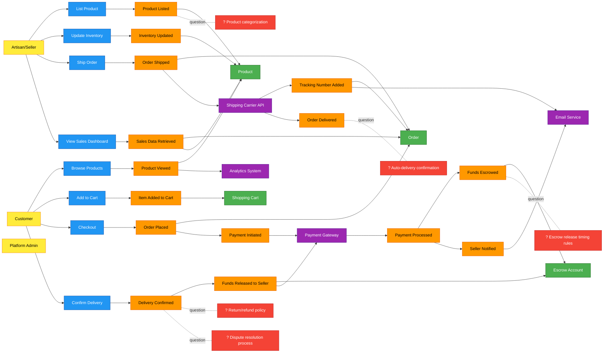
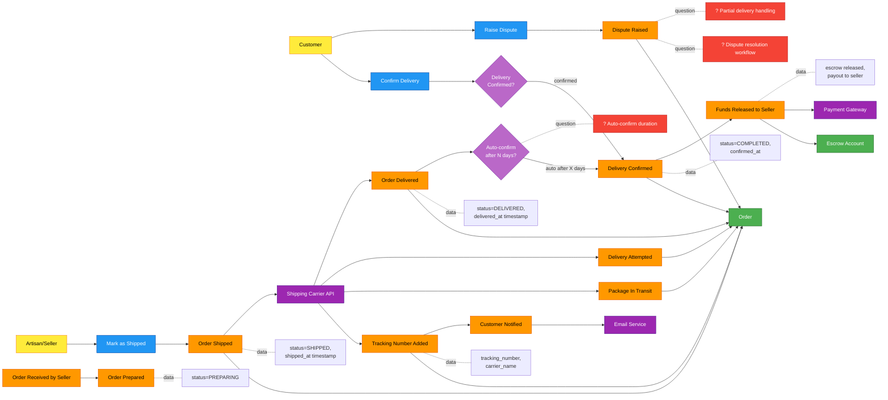
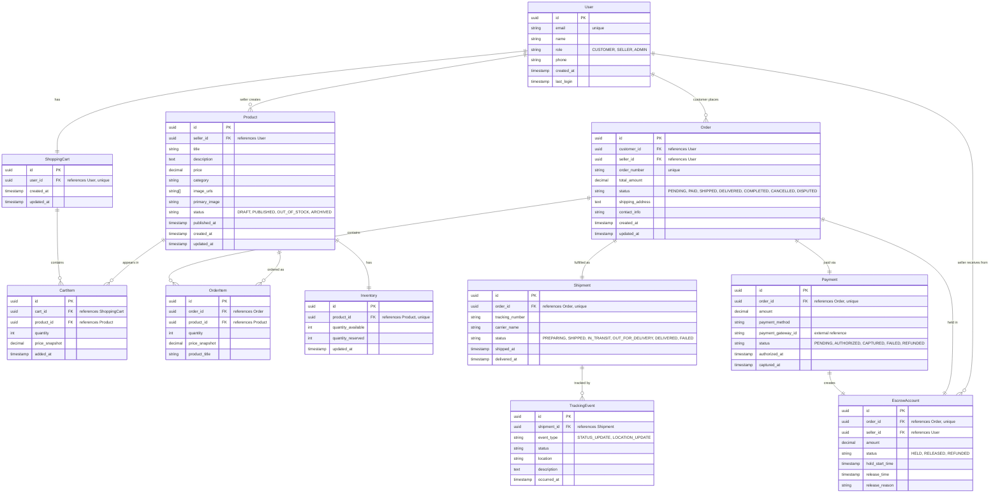
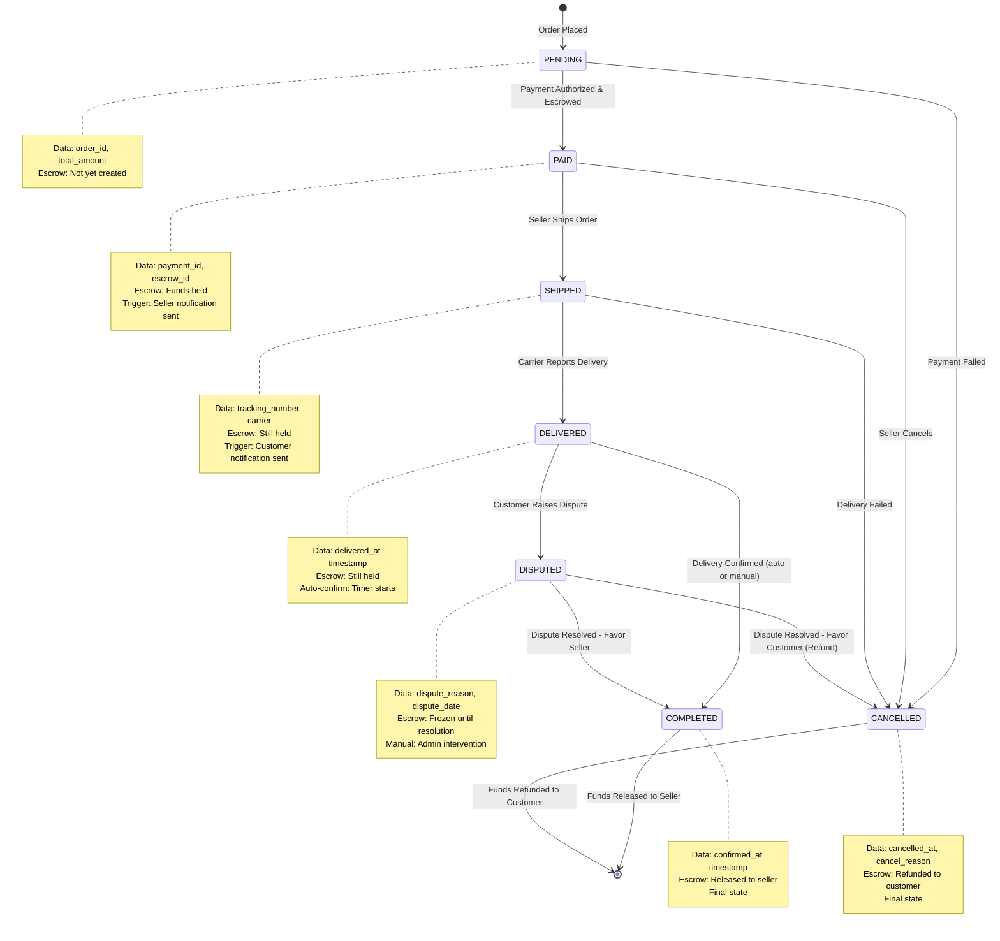
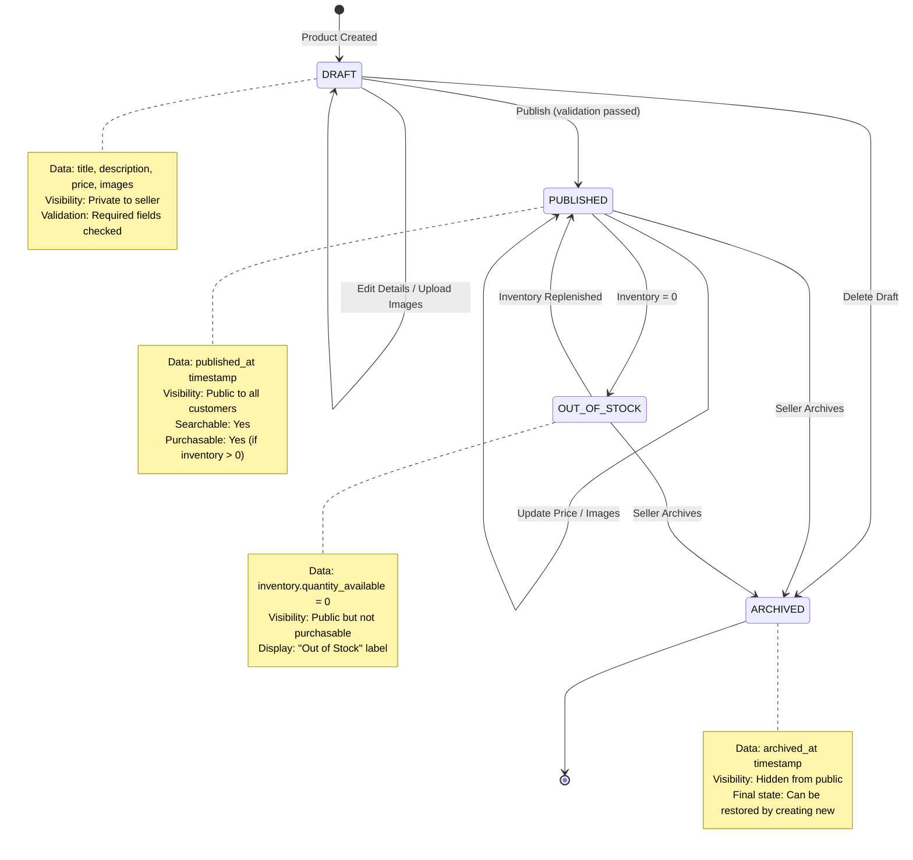
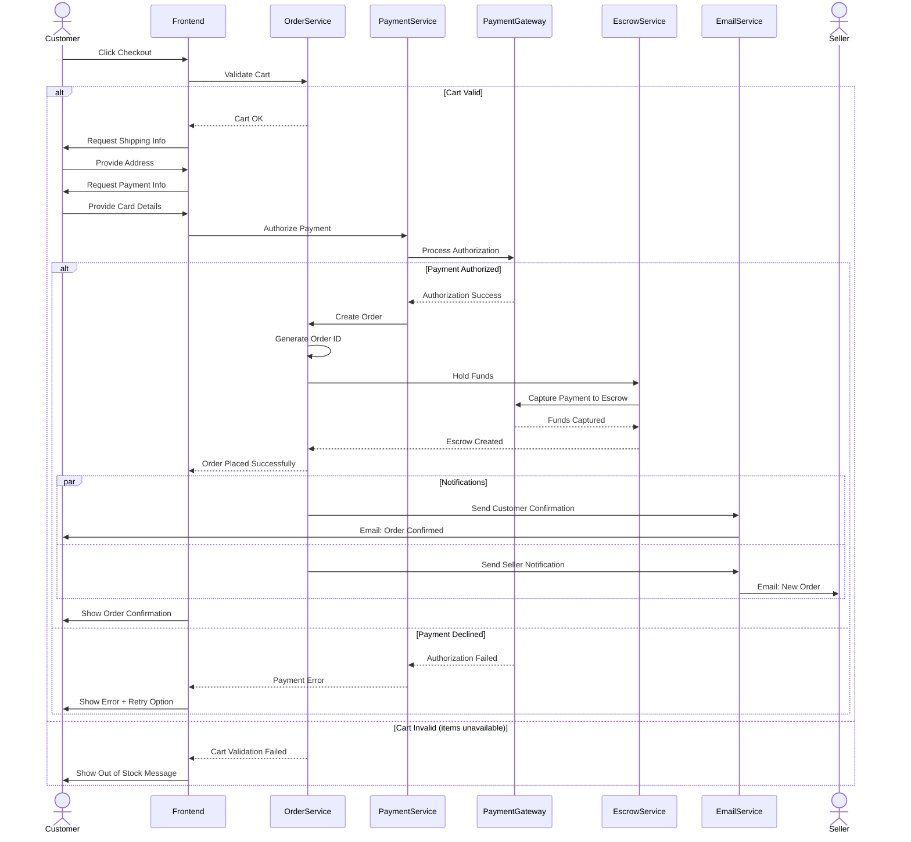
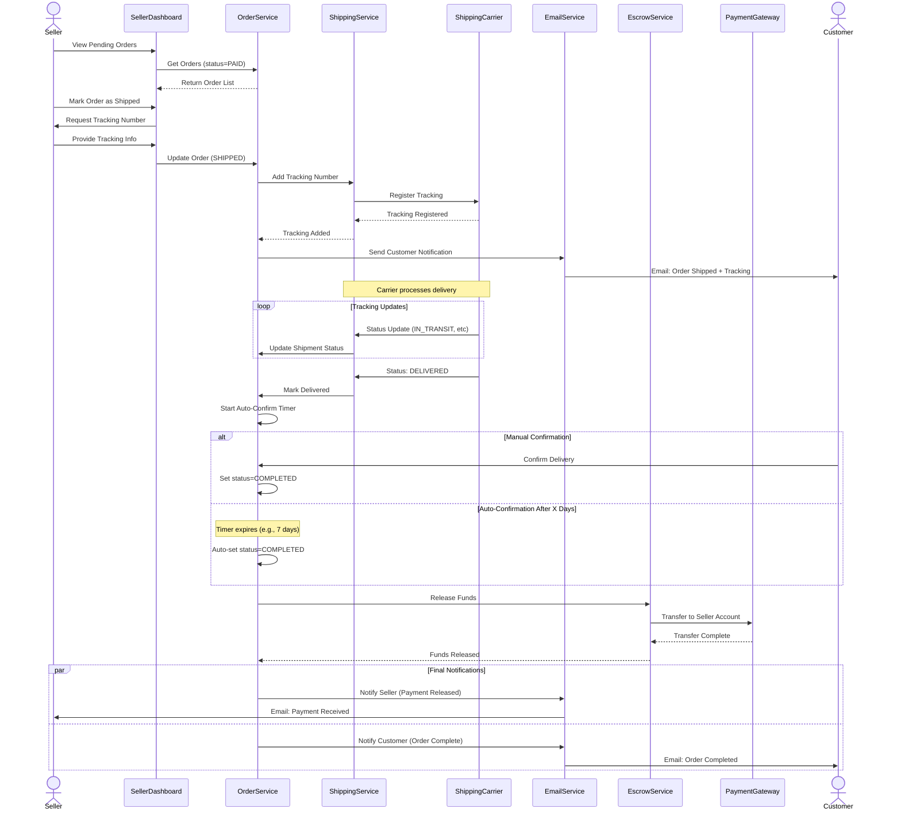
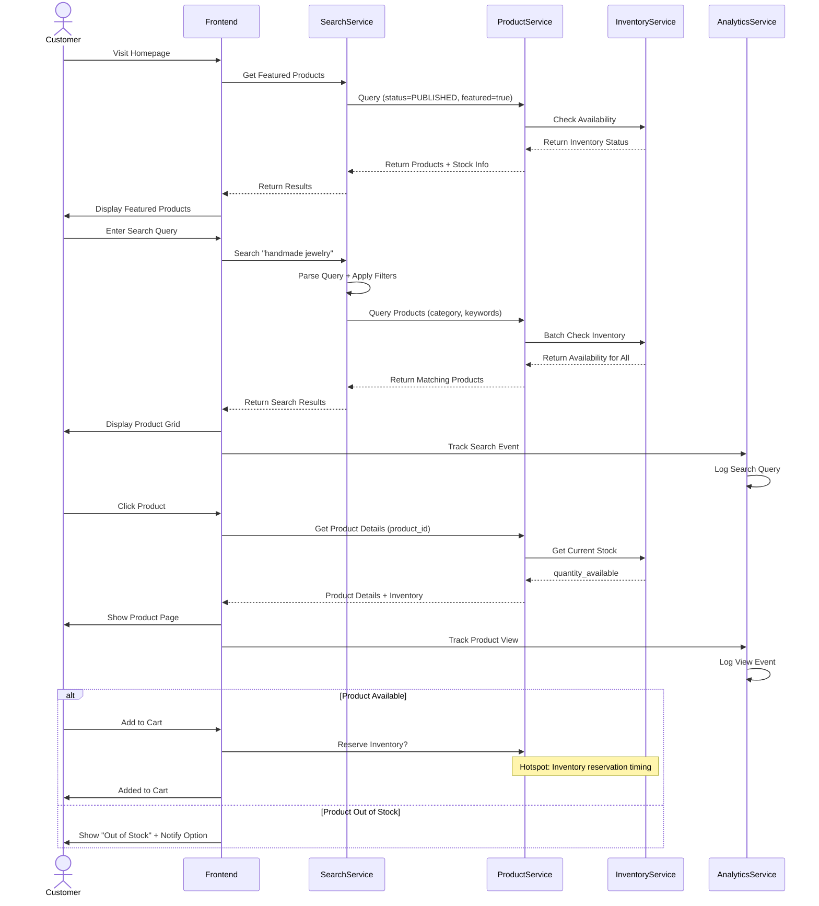

# Design Catalog: Artisan E-commerce Platform

## Overview

An e-commerce platform connecting artisans with customers for selling handmade products. The platform provides a trust layer through escrow-based payments, ensuring safe transactions between makers and buyers while giving artisans full control over their inventory and fulfillment.

## Requirements

See [requirements.md](./requirements.md) for detailed requirements, actors, constraints, and success criteria.

**Key highlights:**
- Target scale: 1K-10K users, 100-1000 products
- Platform escrow payment model
- Seller-managed fulfillment
- Phased rollout: 6-12 months

## Big Picture EventStorming

The following diagram shows the high-level business process with key events, commands, and actors:



[View source](./big-picture.mmd)

## Process Models

Detailed process EventStorming for critical workflows:

### Checkout & Payment Process

Customer checkout flow with cart validation, payment authorization, and escrow creation:

```mermaid
flowchart LR
    %% EventStorming Process Level - Checkout & Payment with Escrow
    classDef event fill:#ff9800,stroke:#e65100,color:#000
    classDef command fill:#2196f3,stroke:#0d47a1,color:#fff
    classDef actor fill:#ffeb3b,stroke:#f57f17,color:#000
    classDef policy fill:#ba68c8,stroke:#6a1b9a,color:#fff
    classDef aggregate fill:#4caf50,stroke:#1b5e20,color:#fff
    classDef system fill:#9c27b0,stroke:#4a148c,color:#fff
    classDef hotspot fill:#f44336,stroke:#b71c1c,color:#fff

    %% Actors & Systems
    Customer[Customer]:::actor
    SysPayment[Payment Gateway]:::system
    SysEmail[Email Service]:::system

    %% Commands
    CmdCheckout[Initiate Checkout]:::command
    CmdSubmitPayment[Submit Payment Info]:::command

    %% Events
    EvtCheckoutStarted[Checkout Started]:::event
    EvtCartValidated[Cart Validated]:::event
    EvtShippingInfoProvided[Shipping Info Provided]:::event
    EvtPaymentInfoProvided[Payment Info Provided]:::event
    EvtOrderCreated[Order Created]:::event
    EvtPaymentAuthorized[Payment Authorized]:::event
    EvtFundsEscrowed[Funds Moved to Escrow]:::event
    EvtSellerNotified[Seller Notified]:::event
    EvtCustomerNotified[Customer Notified]:::event

    %% Aggregates
    AggCart[Shopping Cart]:::aggregate
    AggOrder[Order]:::aggregate
    AggEscrow[Escrow Account]:::aggregate

    %% Policies
    PolicyCartValid{Cart Items<br/>Available?}:::policy
    PolicyPaymentValid{Payment<br/>Authorized?}:::policy

    %% Error Events
    EvtCheckoutFailed[Checkout Failed]:::event
    EvtPaymentFailed[Payment Failed]:::event

    %% Hotspots
    Hot1[? Partial inventory scenarios]:::hotspot
    Hot2[? Payment retry logic]:::hotspot
    Hot3[? Escrow hold duration]:::hotspot

    %% Flow
    Customer --> CmdCheckout
    CmdCheckout --> EvtCheckoutStarted
    EvtCheckoutStarted --> AggCart

    EvtCheckoutStarted --> PolicyCartValid
    PolicyCartValid -->|inventory available| EvtCartValidated
    PolicyCartValid -->|items unavailable| EvtCheckoutFailed
    EvtCartValidated -.question.- Hot1

    EvtCartValidated --> EvtShippingInfoProvided
    EvtShippingInfoProvided -.data.- Note1[shipping_address,<br/>contact_info set]

    Customer --> CmdSubmitPayment
    CmdSubmitPayment --> EvtPaymentInfoProvided
    EvtPaymentInfoProvided --> SysPayment

    SysPayment --> PolicyPaymentValid
    PolicyPaymentValid -->|authorized| EvtPaymentAuthorized
    PolicyPaymentValid -->|declined| EvtPaymentFailed
    EvtPaymentFailed -.question.- Hot2

    EvtPaymentAuthorized --> EvtOrderCreated
    EvtOrderCreated --> AggOrder
    EvtOrderCreated -.data.- Note2[order_id,<br/>total_amount,<br/>status=PENDING]

    EvtOrderCreated --> EvtFundsEscrowed
    EvtFundsEscrowed --> AggEscrow
    EvtFundsEscrowed -.data.- Note3[escrow_amount,<br/>hold_start_time,<br/>seller_id]
    EvtFundsEscrowed -.question.- Hot3

    EvtFundsEscrowed --> EvtSellerNotified
    EvtSellerNotified --> SysEmail

    EvtFundsEscrowed --> EvtCustomerNotified
    EvtCustomerNotified --> SysEmail
```



[View source](./processes/process-checkout-payment.mmd)

### Order Fulfillment Process

Seller shipping workflow, delivery tracking, confirmation, and payment release:



[View source](./processes/process-order-fulfillment.mmd)

### Product Listing Process

Artisan product creation, publishing, inventory management, and customer browsing:

```mermaid
flowchart LR
    %% EventStorming Process Level - Product Listing & Management
    classDef event fill:#ff9800,stroke:#e65100,color:#000
    classDef command fill:#2196f3,stroke:#0d47a1,color:#fff
    classDef actor fill:#ffeb3b,stroke:#f57f17,color:#000
    classDef policy fill:#ba68c8,stroke:#6a1b9a,color:#fff
    classDef aggregate fill:#4caf50,stroke:#1b5e20,color:#fff
    classDef hotspot fill:#f44336,stroke:#b71c1c,color:#fff

    %% Actors
    Seller[Artisan/Seller]:::actor
    Customer[Customer]:::actor

    %% Commands
    CmdCreateProduct[Create Product]:::command
    CmdUploadImages[Upload Images]:::command
    CmdPublishProduct[Publish Product]:::command
    CmdUpdateInventory[Update Inventory]:::command
    CmdUpdatePrice[Update Price]:::command
    CmdBrowse[Browse Products]:::command

    %% Events
    EvtProductDrafted[Product Drafted]:::event
    EvtImagesUploaded[Images Uploaded]:::event
    EvtProductValidated[Product Validated]:::event
    EvtProductPublished[Product Published]:::event
    EvtInventoryUpdated[Inventory Updated]:::event
    EvtPriceUpdated[Price Updated]:::event
    EvtProductViewed[Product Viewed]:::event
    EvtProductSearched[Products Searched]:::event
    EvtOutOfStock[Product Out of Stock]:::event

    %% Aggregates
    AggProduct[Product]:::aggregate
    AggInventory[Inventory]:::aggregate

    %% Policies
    PolicyValidProduct{Product Info<br/>Complete?}:::policy
    PolicyInventoryCheck{Inventory<br/>Available?}:::policy

    %% Hotspots
    Hot1[? Product categorization taxonomy]:::hotspot
    Hot2[? Image quality requirements]:::hotspot
    Hot3[? Inventory reservation timing]:::hotspot
    Hot4[? Search/filter capabilities]:::hotspot

    %% Flow - Create and publish product
    Seller --> CmdCreateProduct
    CmdCreateProduct --> EvtProductDrafted
    EvtProductDrafted --> AggProduct
    EvtProductDrafted -.data.- Note1[title, description,<br/>category, price,<br/>status=DRAFT]
    EvtProductDrafted -.question.- Hot1

    Seller --> CmdUploadImages
    CmdUploadImages --> EvtImagesUploaded
    EvtImagesUploaded --> AggProduct
    EvtImagesUploaded -.data.- Note2[image_urls[],<br/>primary_image]
    EvtImagesUploaded -.question.- Hot2

    Seller --> CmdPublishProduct
    CmdPublishProduct --> PolicyValidProduct
    PolicyValidProduct -->|complete| EvtProductValidated
    PolicyValidProduct -->|incomplete| EvtProductDrafted

    EvtProductValidated --> EvtProductPublished
    EvtProductPublished --> AggProduct
    EvtProductPublished -.data.- Note3[status=PUBLISHED,<br/>published_at]

    %% Flow - Inventory management
    Seller --> CmdUpdateInventory
    CmdUpdateInventory --> EvtInventoryUpdated
    EvtInventoryUpdated --> AggInventory
    EvtInventoryUpdated -.data.- Note4[quantity_available,<br/>updated_at]

    EvtInventoryUpdated --> PolicyInventoryCheck
    PolicyInventoryCheck -->|quantity = 0| EvtOutOfStock
    EvtOutOfStock --> AggProduct
    EvtOutOfStock -.data.- Note5[status=OUT_OF_STOCK]
    EvtInventoryUpdated -.question.- Hot3

    %% Flow - Price updates
    Seller --> CmdUpdatePrice
    CmdUpdatePrice --> EvtPriceUpdated
    EvtPriceUpdated --> AggProduct
    EvtPriceUpdated -.data.- Note6[price, price_updated_at]

    %% Flow - Customer browsing
    Customer --> CmdBrowse
    CmdBrowse --> EvtProductSearched
    EvtProductSearched -.question.- Hot4

    EvtProductSearched --> EvtProductViewed
    EvtProductViewed --> AggProduct
```

[View source](./processes/process-product-listing.mmd)

## Data Model

Entity-relationship diagram showing core data entities and their relationships:



[View source](./data/erd.mmd)

## State Models

State charts for entities with complex lifecycles:

### Order Lifecycle

Order states from PENDING through COMPLETED/CANCELLED, including payment, shipping, delivery confirmation, and escrow release:



[View source](./data/state-order.mmd)

### Product Lifecycle

Product states from DRAFT through PUBLISHED/ARCHIVED, including inventory management and visibility:



[View source](./data/state-product.mmd)

## Critical Flows

Sequence diagrams for important interaction flows:

### Checkout & Escrow Flow

Complete checkout process with cart validation, payment authorization, escrow creation, and notifications:



[View source](./flows/sequence-checkout-escrow.mmd)

### Fulfillment & Release Flow

Order fulfillment from shipping through delivery confirmation and escrow fund release:



[View source](./flows/sequence-fulfillment-release.mmd)

### Product Browse Flow

Customer product discovery, search, view, and add-to-cart interaction:



[View source](./flows/sequence-product-browse.mmd)

## Hotspots & Open Questions

The following areas require decisions or further clarification before implementation:

### Critical Business Logic
1. **Escrow release timing rules** - How long should funds be held? Auto-release after X days or require explicit confirmation?
2. **Auto-delivery confirmation** - Should system auto-confirm delivery after shipping carrier reports "delivered" + X days?
3. **Dispute resolution process** - Workflow when customer claims non-delivery or product issues?
4. **Return/refund policy** - How to handle returns for custom/handmade goods?

### Product Management
5. **Product categorization taxonomy** - What category structure for handmade goods? (Jewelry, Art, Home Decor, etc.)
6. **Search/filter capabilities** - What search features needed? (keyword, category, price range, seller rating, etc.)
7. **Image quality requirements** - Size limits, format requirements, number of images per product?

### Technical Decisions
8. **Inventory reservation timing** - When to reserve inventory: at add-to-cart or checkout?
9. **Partial inventory scenarios** - Handle cases where cart items become partially unavailable during checkout?
10. **Payment retry logic** - Allow retry on payment failure? How many attempts?
11. **Commission/fee structure** - Does platform take a percentage? Fixed fee? How calculated?
12. **Multi-currency support** - International sales supported?

### Seller Onboarding
13. **Seller verification process** - Identity verification, business validation, approval workflow?
14. **Seller dashboard metrics** - What analytics/reports do sellers need?

## Next Steps

### Design Complete
This design catalog provides a comprehensive conceptual model of the artisan e-commerce platform. The next phase depends on your needs:

**Option 1: Implementation Planning**
- Create detailed implementation plan with tasks, file structure, and technical specifications
- Break down into sprints for phased rollout

**Option 2: Resolve Hotspots First**
- Address the 14 open questions above
- Refine business rules and policies
- Update design artifacts with decisions

**Option 3: Technical Architecture**
- Select technology stack (backend framework, database, hosting)
- Design API contracts
- Plan infrastructure and deployment

**Option 4: Prototyping**
- Build clickable prototype to validate UX flows
- Test checkout and seller dashboard concepts
- Gather user feedback

**Recommended:** Resolve critical hotspots (1-4) first, then proceed with implementation planning for Phase 1 MVP (browse, cart, checkout, basic seller dashboard).
